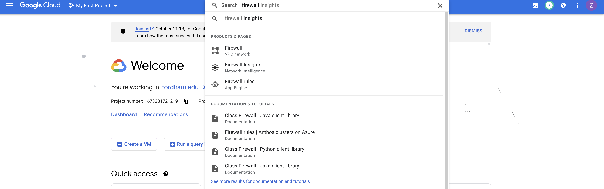
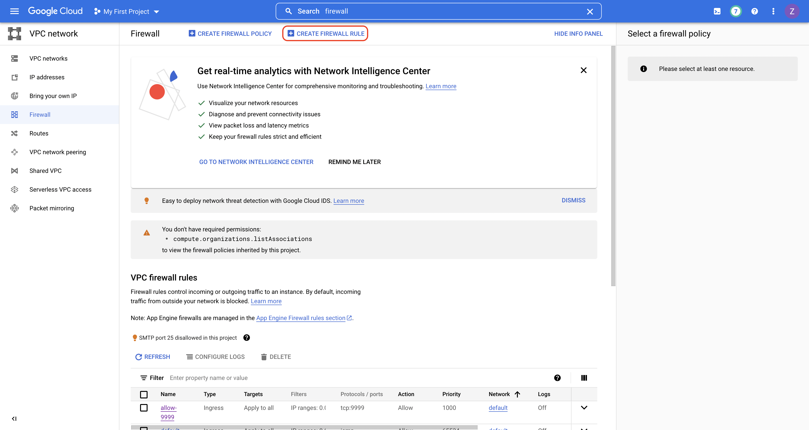
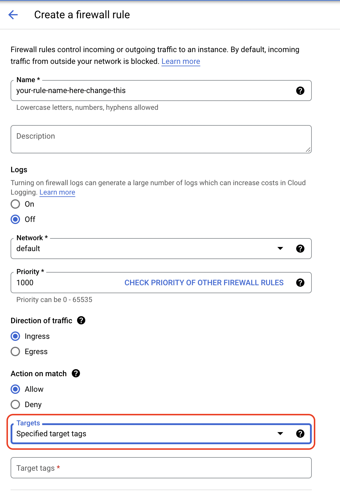
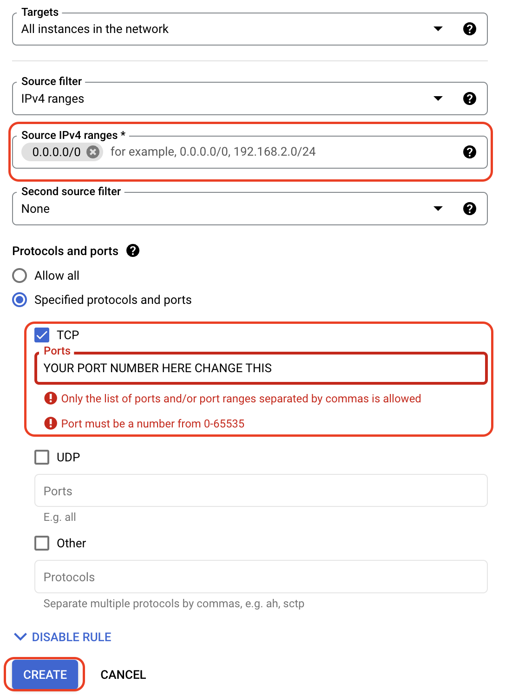
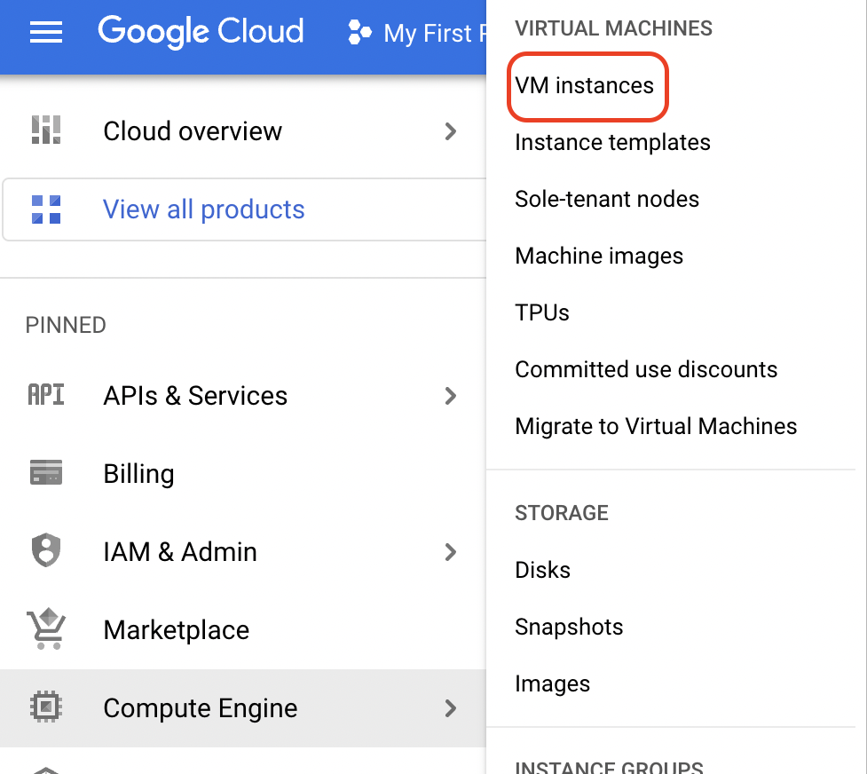
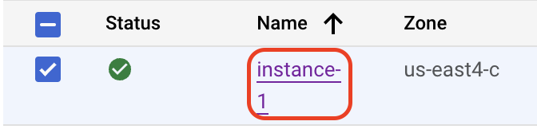
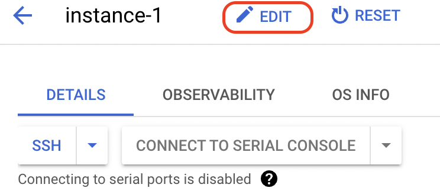
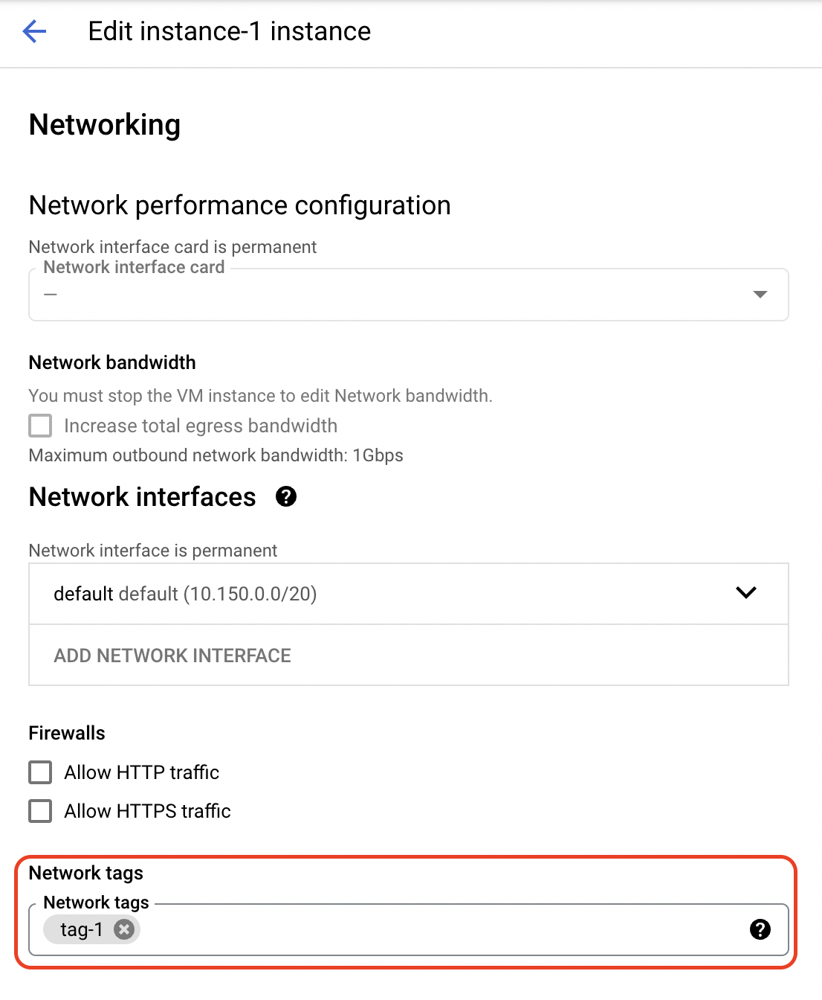

# How to open a port on Google Cloud Platform

## For opening port for all instance

Login to your dashboard [here](https://console.cloud.google.com/). Select the search bar and enter `firewall`.

You will see something like this, click on the `Firewall`.Click `CREATE FIREWALL RULE`.

Click the `Specified target tags` and change it to `All instances in the network`. The `Target tags` field will disappear. 

In the `Source IPv4 ranges`, type in `0.0.0.0/0` to allow all IPs to connect to this port. You can also specify the **exact IP address** you want to allow to access this port by typing in the IP directly. (E.g., `192.168.1.1`)

Select your protocol and fill in the `Ports` field with your port. In the example the sock should use a TCP connection and the port should be `9999`.

Click create to finish creating the rule and the port should be open instantly.

## For opening port on one or more instance(s)

First, go to your `VM instances`.

Click your instance name.

Then click `EDIT`.

Under the `Networking` field, Fill in the `network tags` with your tag. Here, I am using `tag-1` as an example.

Then go through the same firewall creating process, but change the `Targets` to `Specified Target Tags` and fill in the tag you just created.

The rest will be the same. And this should also work instantly.

## FAQ

### I did everything above but it still did not work?

A: Check your code. Change the server IP to `0.0.0.0` to allow it to be connected from outside.

